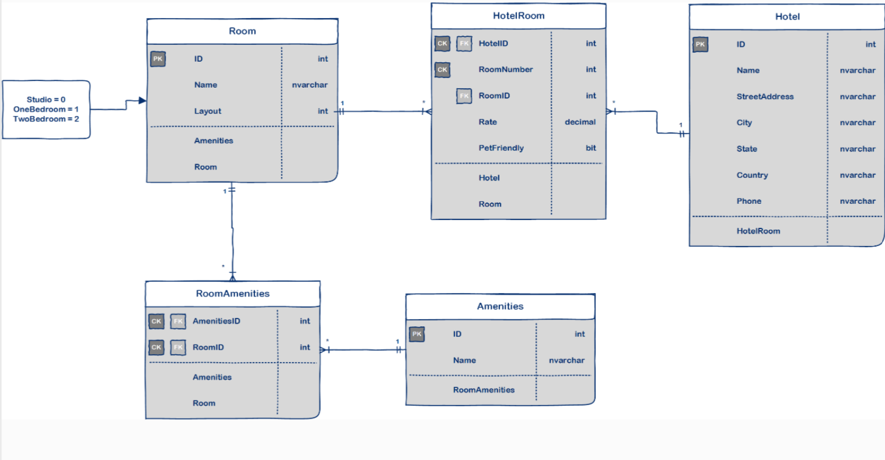
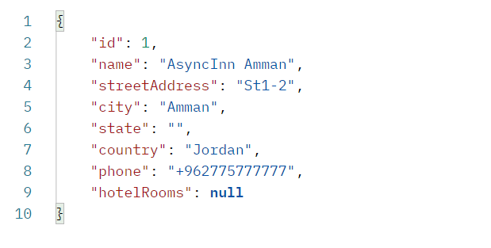
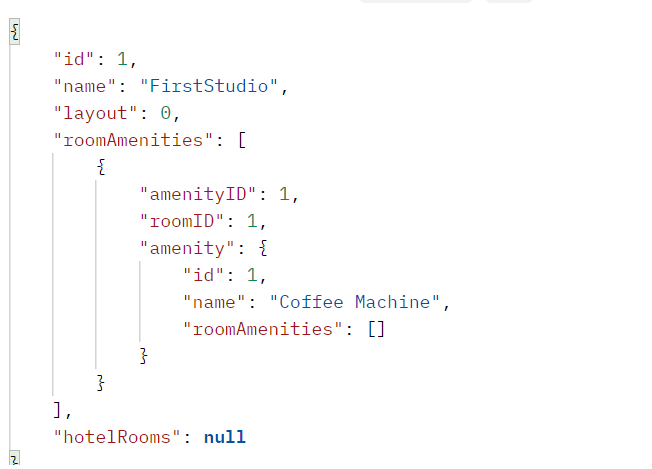
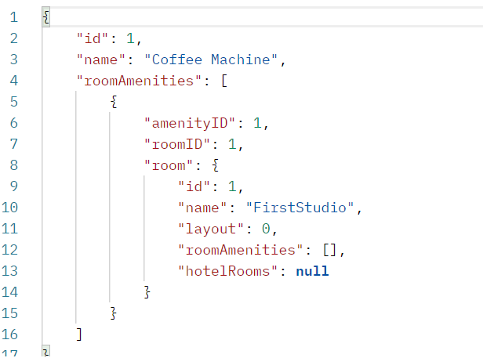

# Project name: Async-Inn
## This done by AbdUlrahman Jaran

## API server for a Hotel Asset Management system.

 <br>

## [Explanation](./Explanation.md)

## Architecture Pattern
This API use Dependency Injection.
Dependency Injection (DI) is a design pattern allows the creation of dependent objects outside of a class and provides those objects to a class through different ways. Using DI, we move the creation and binding of the dependent objects outside of the class that depends on them.

## End Points
### GET a Hotel by Id: /api/Hotels/1<br>


### GET a Room: /api/Rooms/1<br>


### GET an Amenity: /api/Amenities/1<br>


### GET all the rooms for a hotel: /api/HotelRooms/{hotelId}
```c#
[
    {
        "hotelID": 1,
        "roomID": 1,
        "roomNumber": 1,
        "rate": 1.00,
        "petFriendly": 0,
        "hotel": {
            "id": 1,
            "name": "AsyncInn Amman",
            "streetAddress": "St1-2",
            "city": "Amman",
            "state": "",
            "country": "Jordan",
            "phone": "+962775777777",
            "hotelRooms": []
        },
        "room": {
            "id": 1,
            "name": "FirstStudio",
            "layout": 0,
            "roomAmenities": [
                {
                    "amenityID": 1,
                    "roomID": 1,
                    "amenity": {
                        "id": 1,
                        "name": "Coffee Machine",
                        "roomAmenities": []
                    }
                }
            ],
            "hotelRooms": []
        }
    }
]
```

### GET all room details for a specific room: /api/HotelRooms/{hotelId}/Rooms/{roomNumber}
```c#
{
    "hotelID": 1,
    "roomID": 1,
    "roomNumber": 1,
    "rate": 1.00,
    "petFriendly": 0,
    "hotel": {
        "id": 1,
        "name": "AsyncInn Amman",
        "streetAddress": "St1-2",
        "city": "Amman",
        "state": "",
        "country": "Jordan",
        "phone": "+962775777777",
        "hotelRooms": []
    },
    "room": {
        "id": 1,
        "name": "FirstStudio",
        "layout": 0,
        "roomAmenities": [
            {
                "amenityID": 1,
                "roomID": 1,
                "amenity": {
                    "id": 1,
                    "name": "Coffee Machine",
                    "roomAmenities": []
                }
            }
        ],
        "hotelRooms": []
    }
}
```
### GET all the Hotels: /api/Hotels

### GET all the rooms: /api/Rooms

### GET all the Amenities: /api/Amenities

### POST to add a room to a hotel: /api/HotelRooms/{hotelId}/Rooms

### PUT update the details of a specific room: /api/HotelRooms/{hotelId}/Rooms/{roomNumber}

### DELETE a specific room from a hotel: /api/HotelRooms/{hotelId}/Rooms/{roomNumber}